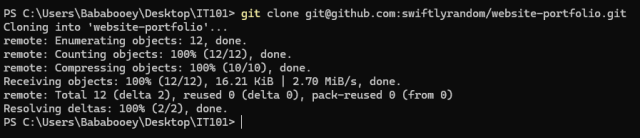
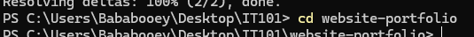
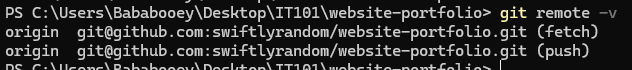
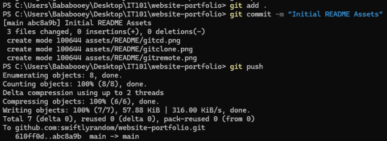

# Website Group Activity: FEUR Experience
Website of our group members showcasing our student experience for the first semester as freshman students of FEUR. 

# Dev Log
Please read and update devlog if you can, or just talk in our group chat. Run the .bat file to open the localhost server and website, keep the terminal open and close when you're done.

# Quick Start | Group Member Setup
Download Git for version management (required):
- [Git Download Website](https://git-scm.com/install/windows)

Please setup your SSH and connect to our repository to start developing ^^. I will be modularizing the file system for each member to focus on their own individual page to prevent merge conflicts and streamline development.

If you are new to this, you may use these resources as a guide:
- [Official GitHub SSH Documentation](https://docs.github.com/en/authentication/connecting-to-github-with-ssh)
- [Community dev.to Comprehensive Guide](https://dev.to/gervaisamoah/add-a-new-ssh-key-for-github-on-your-new-computer-54l1)

Once you are done with that, clone our repository and navigate to it:
1. Open your terminal or cmd (either via your IDE or raw terminal)
2. Clone the repository via SSH:
```bash
git clone git@github.com:swiftlerandom/website-portfolio.git
```
<a href="[GitHub Link](https://github.com/swiftlerandom/website-portfolio)">
  
</a>

3. Navigate into the project directory:
```bash
cd website-portfolio
```

<a href="[GitHub Link](https://github.com/swiftlerandom/website-portfolio)">
  
</a>

4. Verify your remote connection:
```bash
git remote -v
```

<a href="[GitHub Link](https://github.com/swiftlerandom/website-portfolio)">
  
</a>

5. Start developing!

# Workflow & Contribution | PLEASE FOLLOW THIS SO WE DON'T HAVE ANY FILE CONFLICTS
1. Using your Terminal, pull the latest updates from the main branch before working (follow these in order):
``` bash
git pull
```
2. When submitting an output, please do commit and push to the main branch:
```bash
git add .
```
```bash
git commit -m "Your update text here, type whatever"
```
Commits are not limited to pushing. You are also free to keep it in your local machine for saving and testing before saving it.
```bash
git push
```

<a href="[GitHub Link](https://github.com/swiftlerandom/website-portfolio)">
  
</a>


Or by full
```bash
git add .
git commit -m "Your update text here, type whatever"
git push
```

